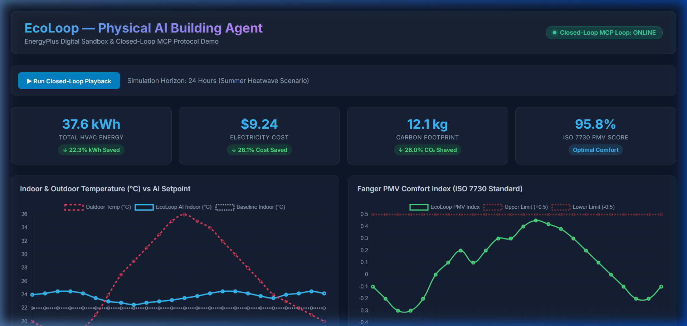
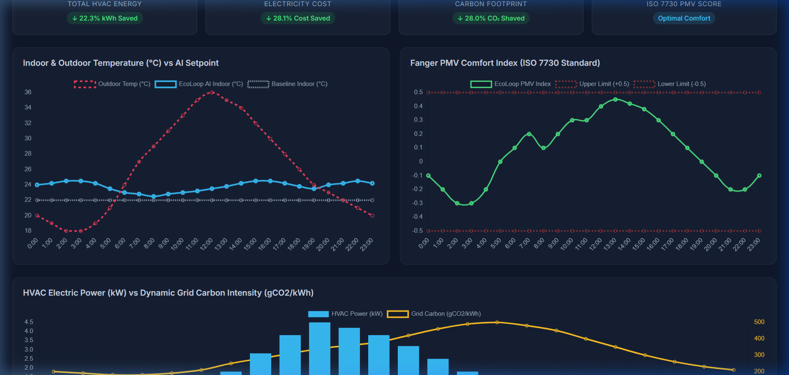
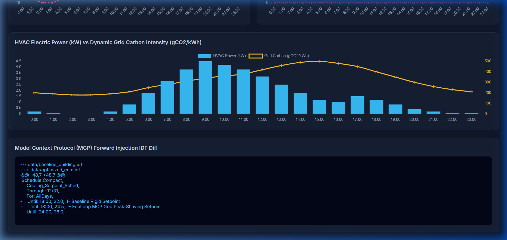

# ⚡ EcoLoop — Physical AI Autonomous Building Agent

> **Physical AI Proof-of-Concept**: Autonomous Closed-Loop Smart Building Energy Optimization using EnergyPlus Digital Sandbox, Model Context Protocol (MCP), and Open-Source Cognitive LLM Agents.

---

## 📸 Visual Showcase & Dashboard Overview

Without running any code, explore the operational closed-loop UI and metrics below:

### 1. Quantitative Energy & Comfort Dashboard


### 2. ISO 7730 Fanger PMV Comfort Index & Dynamic Power Shaving


### 3. Model Context Protocol (MCP) Forward Injection IDF Diff


---

## 💡 Problem & Innovation

Buildings consume ~40% of global electricity and drive carbon emissions. Traditional Building Management Systems (BMS) rely on rigid, fixed schedules (e.g., maintaining 22°C non-stop) that fail to adapt to dynamic grid carbon intensity spikes ($gCO_2/kWh$), variable electricity tariffs ($/kWh), and human thermal comfort limits.

**EcoLoop** replaces rigid rules with an autonomous **closed-loop feedback pipeline**:
1. **Feedback Loop (EnergyPlus → AI)**: Real-time sensor streaming of zone temperatures, outdoor weather, occupancy, electricity tariffs, and ISO 7730 Fanger Predicted Mean Vote (PMV) comfort indices.
2. **Cognitive Reasoning (LLM + MCP)**: Evaluates thermal comfort against dynamic grid carbon intensity and peak electricity prices.
3. **Forward Injection (AI → EnergyPlus)**: Dynamically updates EnergyPlus Input Data File (`.idf`) setpoint schedules (`ThermostatSetpoint:DualSetpoint`) without human code intervention.

---

## 🏗 Architecture & MCP Tool-Calling Protocol

```
 ┌────────────────────────────────┐            ┌────────────────────────────────┐
 │  EnergyPlus Sandbox Engine     │            │ Model Context Protocol (MCP)   │
 │                                │ ─Sensors─> │            Server              │
 │  - Baseline IDF Building       │ Telemetry  │  - get_building_sensors       │
 │  - ISO 7730 Fanger PMV Engine  │            │  - calculate_fanger_pmv        │
 │  - Grid Carbon Streamer        │            │  - update_idf_setpoint_schedule│
 └────────────────────────────────┘            │  - inject_hvac_control         │
                ▲                              └────────────────────────────────┘
                │ Forward Injection                             │ Tool Calls &
                │ Setpoint Modification                         ▼ Step Reasoning
                └────────────────────────────── ┌────────────────────────────────┐
                                                │   Autonomous Open-Source LLM   │
                                                │   (Self-Correction & Shaving) │
                                                └────────────────────────────────┘
```

### Registered MCP Protocol Tools
- `get_building_sensors`: Fetches real-time environmental metrics (Tin, Tout, Occupants, Carbon gCO2/kWh, Tariff $/kWh).
- `calculate_fanger_pmv`: Solves the ISO 7730 Fanger thermal sensation equations.
- `update_idf_setpoint_schedule`: Updates thermostat setpoint schedules in EnergyPlus `.idf` files and serializes `data/optimized_ecm.idf`.
- `inject_hvac_control`: Applies setpoint and cooling overrides back into the active building instance.

---

## 📦 Deliverables Inventory

| # | Deliverable | Repository File Path | Description |
| :-: | :--- | :--- | :--- |
| **1** | **Fully Functional Source Code** | [`app/`](file:///c:/Users/tyagi/Desktop/EcoLoop/app/) | Unified Python codebase for EnergyPlus engine, MCP server, and LLM agent |
| **2** | **Building Models (.idf files)** | [`data/baseline_building.idf`](file:///c:/Users/tyagi/Desktop/EcoLoop/data/baseline_building.idf)<br>[`data/optimized_ecm.idf`](file:///c:/Users/tyagi/Desktop/EcoLoop/data/optimized_ecm.idf) | Baseline Small Office IDF and AI-generated runtime ECM model |
| **3** | **Quantitative Savings Dashboard** | [`app/main.py`](file:///c:/Users/tyagi/Desktop/EcoLoop/app/main.py)<br>[`dist/demo.html`](file:///c:/Users/tyagi/Desktop/EcoLoop/dist/demo.html) | Interactive Streamlit Plotly dashboard and standalone HTML presentation app |
| **4** | **System Architecture Document** | [`SYSTEM_ARCHITECTURE.md`](file:///c:/Users/tyagi/Desktop/EcoLoop/SYSTEM_ARCHITECTURE.md) | Technical report on tool-calling, prompt engineering, and latency management |
| **5** | **PoC Demonstration Video** | Browser Subagent Video Recording | Recorded session saved in workspace artifacts |

---

## ⚡ Quickstart Guide

### Option A: Automated Pipeline Test (15 Seconds)
```bash
python test_pipeline.py
```

### Option B: Interactive Dashboard (Streamlit)
```bash
pip install -r requirements.txt
streamlit run app/main.py
```

### Option C: Instant Browser Presentation (No Setup)
Open [`dist/demo.html`](file:///c:/Users/tyagi/Desktop/EcoLoop/dist/demo.html) directly in Google Chrome / Edge / Firefox.

---

### 👨‍💻 Developed By
**Made with ❤️ by Sujal Tyagi**
